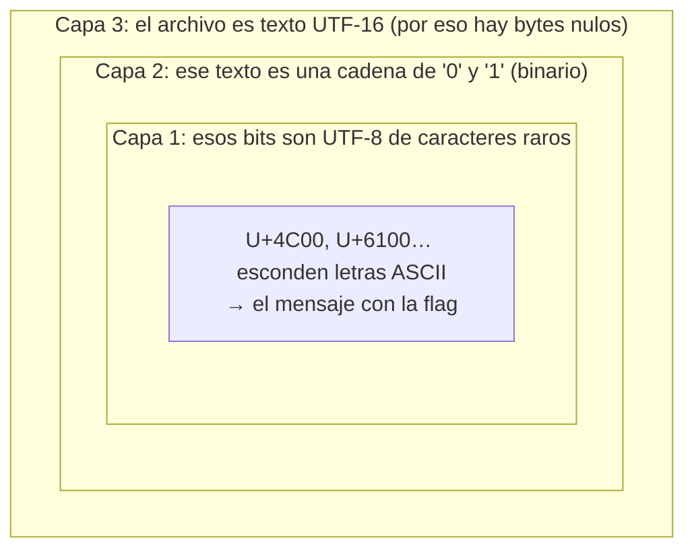
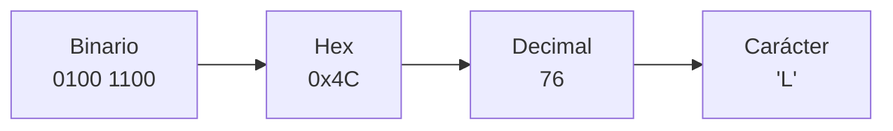
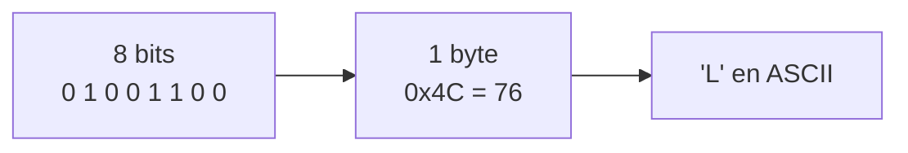
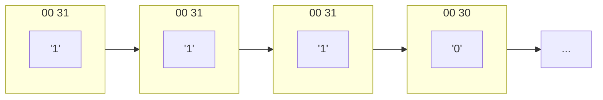
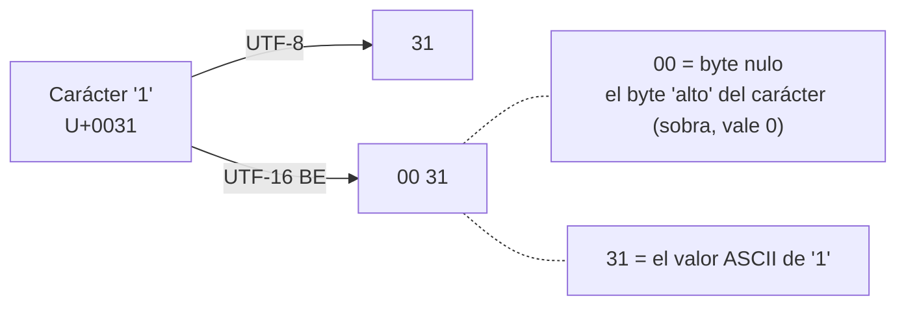
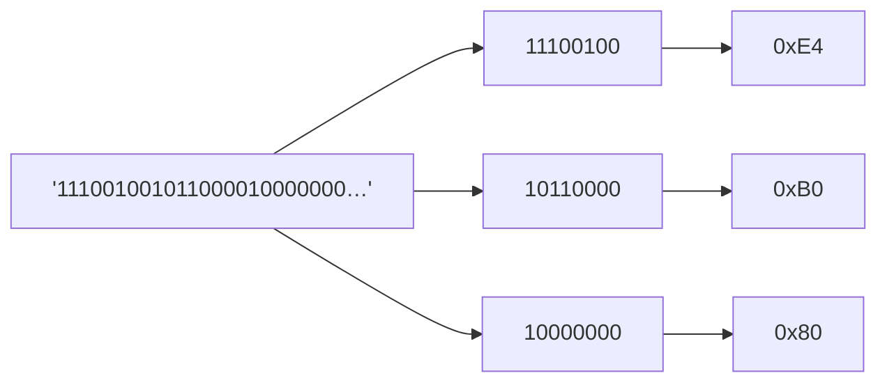
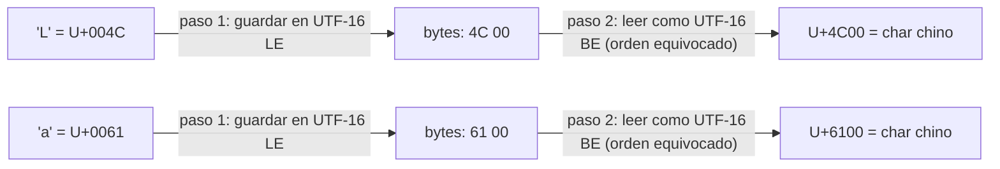
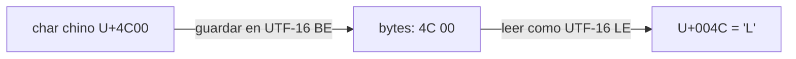
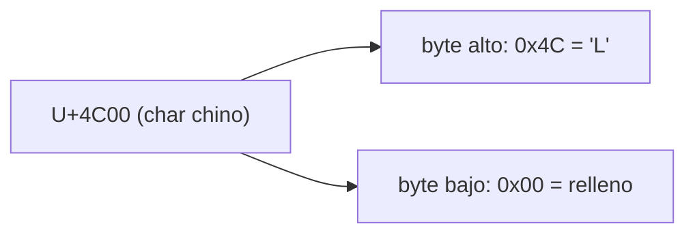
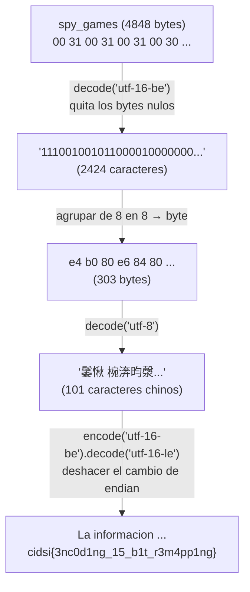

# Spy Games — Writeup

| Campo      | Valor                    |
|------------|--------------------------|
| CTF        | CIDSI                    |
| Categoría  | Reversing                |
| Puntos     | 300                      |
| Archivo    | `spy_games` (4848 bytes) |
| Flag       | `cidsi{3nc0d1ng_15_b1t_r3m4pp1ng}` |

> *"Se ha conseguido una extraña cadena codificada en una partición oculta de un disco duro, ¿puedes acceder a la información que está en él?"*

> Este write-up está pensado para alguien que **empieza de cero**. Explico cada palabra técnica (bit, byte, hexadecimal, encoding, terminal, cada comando…) la primera vez que aparece. Si ya dominas algo, sáltatelo. Hay un documento hermano, `conceptos_bytes.md`, que profundiza aún más en los bytes nulos y el endianness.

---

## 0. ¿Qué es esto y qué hay que hacer?

### 0.1 Vocabulario mínimo del reto

- Un **CTF** (*Capture The Flag*) es una competición de retos de seguridad informática. En cada reto tienes que encontrar una **flag**: un texto secreto con un formato fijo. En este CTF las flags se ven así: `cidsi{...}`. Cuando encuentres ese texto, has resuelto el reto.
- La categoría **Reversing** (ingeniería inversa) significa: te dan algo (un archivo, un programa) y tienes que **entender cómo está hecho por dentro** para sacarle la información escondida. Aquí no hay que romper nada: hay que **descodificar** un archivo.

### 0.2 La idea en una frase

Nos dan un archivo llamado `spy_games`. Dentro, el mensaje con la flag está **envuelto en tres capas de codificación**, una dentro de otra, como una muñeca rusa (matrioska):



Resolver el reto es **quitar las capas de fuera hacia dentro**. En cada paso te explico *qué* se hace, *por qué*, *cómo*, y *qué esperamos obtener*.

> No pasa nada si ahora mismo no entiendes qué es "UTF-16" o "byte nulo". Para eso está la sección 1. Léela con calma antes de seguir.

---

## 1. Conceptos previos (la base que necesitas)

Todo el reto se apoya en estas ideas. Sin ellas, los pasos siguientes parecen magia; con ellas, son evidentes.

### 1.1 Sistemas de numeración: binario, decimal y hexadecimal

Un mismo número se puede escribir de varias maneras. Cambia la "vestimenta", no el valor.

- **Decimal** (base 10): el de toda la vida, usa los dígitos `0`–`9`. Ej: `76`.
- **Binario** (base 2): solo usa `0` y `1`. Es el idioma nativo del ordenador, porque un cable solo puede estar "apagado" (0) o "encendido" (1). Ej: `76` en binario es `1001100`.
- **Hexadecimal** (base 16, "hex"): usa `0`–`9` y luego `A`,`B`,`C`,`D`,`E`,`F` para los valores 10 a 15. Se escribe con el prefijo `0x` para no confundirlo. Ej: `76` en hex es `0x4C`.

**¿Por qué existe el hexadecimal?** Porque el binario es larguísimo de leer (`01001100`) y el hex lo resume: **cada dígito hex equivale a exactamente 4 bits**. Así, 8 bits = 2 dígitos hex. Es taquigrafía para humanos.



Cómo se convierte `0100 1100` a hex: partes los 8 bits en dos mitades de 4 → `0100` y `1100`. `0100` en binario es 4 → dígito hex `4`. `1100` es 12 → dígito hex `C`. Resultado: `4C`.

> No necesitas convertir a mano: cualquier calculadora o Python lo hace. Pero sí conviene **entender que son el mismo número disfrazado**, porque las herramientas te lo mostrarán a veces en hex y a veces en decimal.

### 1.2 Bit y byte

- Un **bit** es la unidad mínima: un `0` o un `1`.
- Un **byte** son **8 bits juntos**. Con 8 bits puedes formar 256 combinaciones distintas, así que un byte vale de `0` a `255` (en hex, de `0x00` a `0xFF`).



El byte es la "unidad de trabajo": los archivos, la memoria y todo lo demás se miden en bytes.

### 1.3 ASCII: convertir números en letras

El ordenador solo guarda números. Para guardar **texto**, hace falta una tabla que diga "el número tal representa la letra cual". La tabla más básica se llama **ASCII**, y asigna a cada letra común un número menor que 128.

| Carácter | Decimal | Hex    | Binario    |
|----------|---------|--------|------------|
| `'0'`    | 48      | `0x30` | `00110000` |
| `'1'`    | 49      | `0x31` | `00110001` |
| `'L'`    | 76      | `0x4C` | `01001100` |
| `'c'`    | 99      | `0x63` | `01100011` |
| espacio  | 32      | `0x20` | `00100000` |

⚠️ **Punto que confunde a todo el mundo al empezar:** el **carácter** `'0'` NO es el **byte** `0x00`.
- El carácter `'0'` (el que ves impreso) es el byte `0x30` (48).
- El byte `0x00` es el **"byte nulo"**: un byte con todos los bits a cero. Representa "nada" y la pantalla normalmente **no dibuja nada** para él. Recuérdalo, porque es el corazón de este reto.

### 1.4 Unicode, UTF-8 y UTF-16 (y por qué hay que elegir)

ASCII solo tiene 128 caracteres: se queda corto para chino, emojis, tildes, etc. Para eso existe **Unicode**, una tabla gigante que le da a **cada** carácter del mundo un número llamado **code point**, que se escribe con el prefijo `U+`:

- `'A'` → `U+0041`
- `'ñ'` → `U+00F1`
- `'䰀'` → `U+4C00`  (un carácter chino que aparecerá luego)

Pero un code point es solo un **número**. Para guardarlo en un archivo hay que decidir **cómo lo partimos en bytes**. Esa decisión se llama **codificación** (en inglés, *encoding*). Las dos que nos importan:

| Encoding   | Cómo guarda cada carácter                       | El carácter `'0'` (U+0030) se guarda como |
|------------|--------------------------------------------------|-------------------------------------------|
| **UTF-8**  | 1 a 4 bytes según el carácter (ASCII = 1 byte)   | `30`                                      |
| **UTF-16** | 2 bytes (casi siempre) para cada carácter        | `00 30`                                   |

Fíjate en la diferencia: en UTF-8, el `'0'` ocupa **1 byte** (`30`). En UTF-16 ocupa **2 bytes** (`00 30`), y aparece un `00` extra. **Ese `00` extra son nuestros bytes nulos.** Volveremos a ello en la sección 3.

### 1.5 Big Endian y Little Endian (el orden de los bytes)

Cuando un carácter ocupa 2 bytes (como en UTF-16), hay que escribirlos en el archivo uno detrás de otro. ¿Cuál va primero? Hay dos convenios:

- **Big Endian (BE):** primero el byte "grande". El `'0'` (U+0030) se guarda `00 30`.
- **Little Endian (LE):** primero el byte "pequeño". El `'0'` se guarda `30 00`.

Es como las fechas: `24/09` (día primero, estilo español) y `09/24` (mes primero, estilo EE. UU.) son **la misma fecha en distinto orden**. Si lees una con el convenio equivocado, entiendes mal. Con los bytes pasa igual, y ese malentendido es, de hecho, el truco de la última capa del reto.

> Si esto te suena a chino (nunca mejor dicho), en `conceptos_bytes.md` está explicado con muchos más ejemplos. Con lo de aquí es suficiente para seguir.

### 1.6 La terminal y las herramientas que usaremos

La **terminal** (o "consola") es una ventana donde escribes comandos de texto y el ordenador responde. Cada comando es un mini-programa. Estos son los que usaremos; no hace falta memorizarlos, los explico al usarlos:

| Comando  | Para qué sirve |
|----------|----------------|
| `file`   | Adivina qué tipo de archivo es. |
| `cat`    | Vuelca el contenido de un archivo en la pantalla. |
| `xxd`    | Muestra el contenido en **hexadecimal** (los bytes de verdad). |
| `tr`     | Transforma o borra caracteres de un texto. |
| `wc`     | Cuenta (bytes, líneas, palabras). |
| `python` | Ejecuta código Python, para lo que los comandos no alcanzan. |

**Cómo ejecutar Python (dos formas):**
- *Una línea suelta:* `python3 -c "codigo aquí"` ejecuta ese código y termina.
- *Un archivo:* guardas el código en `solve.py` y ejecutas `python3 solve.py`.

Cuando veas `>>>` en los bloques de código, significa que estoy en el **modo interactivo** de Python (escribes una línea y te responde al momento). Lo que va después de `>>>` es lo que escribo; la línea de abajo es la respuesta.

Con esto ya tenemos toda la base. Vamos al archivo.

---

## 2. Reconocimiento (mirar el archivo por fuera)

**Qué hacemos:** antes de tocar nada, preguntamos qué tipo de archivo es.
**Por qué:** te ahorra horas. Muchas veces `file` ya te dice por dónde van los tiros.

```bash
$ file spy_games
spy_games: data
```

`file` responde `data`, que en su jerga significa *"son bytes, pero no reconozco ningún formato conocido"*. No nos ayuda mucho, así que miramos el contenido directamente:

```bash
$ cat spy_games
111001001011000010000000111001101000010010000000...
```

`cat` vuelca el archivo en pantalla y vemos una tira larguísima de **ceros y unos**. Eso *parece* binario escrito como texto. La reacción natural es: "vale, convierto estos bits a bytes con Python y listo". Y justo ahí aparece el problema del reto.

**Qué esperábamos y qué obtuvimos:** esperábamos texto reconocible; obtuvimos una cadena de bits aparentemente limpia. Guarda esa palabra: *aparentemente*.

---

## 3. Capa 3 — Los bytes nulos (la parte clave del reto)

### 3.1 El síntoma: Python "revienta"

**Qué hacemos:** intentar lo obvio: leer el archivo y pasarlo por `int(cadena, 2)` (`int(..., 2)` interpreta una cadena de `0`/`1` como número binario).
**Por qué:** para descubrir por las malas que el archivo no es lo que parece.

Al leer el archivo **crudo** (sin decodificar) y hacer `int(cadena, 2)`, Python lanza un **error** (una queja del programa cuando algo va mal). Pruébalo tú mismo con este comando (léelo así: *lee el archivo en modo binario `'rb'` y conviértelo entero como número binario*):

```bash
$ python3 -c "print(int(open('spy_games','rb').read(), 2))"
```

Salida:

```
ValueError: invalid literal for int() with base 2: b'\x001\x001\x001\x000...'
```

Lee con lupa el texto del error. Entre cada `1` y cada `0` hay un `\x00`. Recuerda de la sección 1.3: `\x00` es la forma de escribir el **byte nulo** (el byte que vale 0). Así que la cadena **no era** `"1110..."` sino:

```
\x00 1 \x00 1 \x00 1 \x00 0 ...
```

**¿Por qué `cat` no los mostró?** Porque, como dijimos en 1.3, la pantalla **no dibuja nada** para el byte `0x00`. Estaban ahí todo el tiempo, invisibles. Por eso la cadena *parecía* limpia.

> 🔑 Lección temprana: **lo que la terminal muestra no siempre son los bytes reales.** Hay caracteres invisibles.

> ⚠️ **Detalle:** este error salta solo cuando haces `int()` de **toda** la cadena cruda de una vez. Si en cambio **recorres** los bytes (un bucle, `list(cadena)`…) no hay error: obtienes los valores byte a byte (verás `0` en cada nulo, `49` en cada `'1'`, `48` en cada `'0'`).

### 3.2 Confirmarlo con un volcado hexadecimal

**Qué hacemos:** mirar los bytes de verdad con `xxd`.
**Por qué:** `xxd` no oculta nada; muestra cada byte en hexadecimal, incluidos los invisibles.

```bash
$ xxd spy_games | head -3
00000000: 0031 0031 0031 0030 0030 0031 0030 0030  .1.1.1.0.0.1.0.0
00000010: 0031 0030 0031 0031 0030 0030 0030 0030  .1.0.1.1.0.0.0.0
00000020: 0031 0030 0030 0030 0030 0030 0030 0030  .1.0.0.0.0.0.0.0
```

Cómo se lee la salida de `xxd`, columna por columna:
- **Izquierda** (`00000000:`): la posición (en hex) donde empieza esa línea.
- **Centro** (`0031 0031 ...`): los bytes en hexadecimal, de dos en dos.
- **Derecha** (`.1.1.1.0`): esos mismos bytes como caracteres. **Cada punto `.` es un byte que no se puede imprimir** (aquí, el `0x00`).

Ahora se ve clarísimo: los bytes van en parejas `00 31`, `00 31`, `00 30`…



### 3.3 ¿Por qué pasa esto? → El archivo está en UTF-16

Vuelve a la tabla de la sección 1.4: en **UTF-16**, el carácter `'1'` (U+0031) se guarda como `00 31`, y el `'0'` (U+0030) como `00 30`. **Es exactamente lo que vemos en el `xxd`.**

Conclusión: los bytes nulos **no son basura ni ruido metido a propósito**. Son parte de la codificación UTF-16. Como `'0'` y `'1'` son caracteres ASCII (números pequeños, menores que 256), al guardarlos en 2 bytes el primer byte siempre sobra y queda a cero.



Esto ocurre muchísimo en la vida real: muchos programas y sistemas guardan texto en UTF-16 por defecto. Cualquier herramienta que espere ASCII/UTF-8 ve "letras separadas por nulos". Reconocer ese patrón es una habilidad que usarás una y otra vez.

**Comprobación:** podemos verificar con Python que *todos* los bytes en posición par son `0x00` y los impares son `'0'` o `'1'`. Comando:

```bash
$ python3 -c "d=open('spy_games','rb').read(); print(len(d), set(d[0::2]), set(d[1::2]))"
```

Salida:

```
4848 {0} {48, 49}
```

Qué significa cada trozo:
- `d[0::2]` toma los bytes en posición 0, 2, 4… (los pares). `set(...)` los agrupa sin repetir. Resultado `{0}`: **todos** valen 0.
- `d[1::2]` toma los impares. Resultado `{48, 49}`: solo aparecen 48 (`'0'`) y 49 (`'1'`).

Confirmado: el archivo son caracteres `'0'`/`'1'` guardados en UTF-16.

### 3.4 Cómo quitar esta capa (dos formas)

**Forma "a lo bruto"** — borrar del archivo todo lo que no sea `0` o `1`:

```bash
$ tr -cd '01' < spy_games > bits.txt
$ wc -c bits.txt
2424 bits.txt
```

Desglose:
- `tr -cd '01'` → `-d` significa *delete* (borrar), y `-c` significa *complemento* (lo contrario). Juntos: "borra todo lo que **no** sea `0` ni `1`". Así desaparecen los bytes nulos.
- `< spy_games` mete el archivo como entrada; `> bits.txt` guarda el resultado en un archivo nuevo.
- `wc -c` cuenta los bytes del resultado: **2424**.

Funciona, pero es un parche: quita los nulos sin *entender* por qué estaban.

**Forma "correcta"** — decirle a Python que el archivo es UTF-16 y que lo decodifique bien. Este comando decodifica y de paso cuenta cuántos caracteres quedan:

```bash
$ python3 -c "print(len(open('spy_games','rb').read().decode('utf-16-be')))"
```

Salida:

```
2424
```

`.decode('utf-16-be')` interpreta cada pareja `00 31` como el carácter que de verdad es (`'1'`) y te deja solo el texto limpio.

Ambas formas dan lo mismo: **4848 bytes ÷ 2 = 2424 caracteres** de `'0'`/`'1'`. Y 2424 es divisible entre 8 (2424 ÷ 8 = 303), lo cual es **buena señal**: los bits se agruparán en bytes exactos, sin sobrar ninguno.

> 💡 **Regla de oro:** si ves un archivo con un `\x00` cada dos bytes, piensa **UTF-16** de inmediato. Si el nulo va *antes* del carácter (`00 31`) es Big Endian; si va *después* (`31 00`) es Little Endian.

---

## 4. Capa 2 — De bits a bytes

**Qué hacemos:** agrupar los 2424 bits de 8 en 8, convertir cada grupo en un byte y **guardar el resultado en un archivo** (`salida.bin`) para examinarlo.
**Por qué:** porque "texto de ceros y unos" no es información útil todavía; hay que volverlo bytes reales para ver qué esconden. Y guardarlo en un archivo nos deja usar `file` y `xxd` sobre él.

Este comando hace las dos capas de golpe (quita nulos + agrupa de 8 en 8) y escribe `salida.bin`:

```bash
$ python3 -c "
bits = open('spy_games','rb').read().decode('utf-16-be')
data = bytes(int(bits[i:i+8], 2) for i in range(0, len(bits), 8))
open('salida.bin','wb').write(data)
print('escritos', len(data), 'bytes')
"
```

Salida:

```
escritos 303 bytes
```

Qué hace la línea del medio, en cristiano: recorre la cadena de 8 en 8 caracteres (`bits[i:i+8]`), convierte cada grupito de 8 bits en su número (`int(..., 2)`), y junta todos esos números en una secuencia de bytes.



Obtenemos **303 bytes**. ¿Qué son? Se lo preguntamos a `file` (ahora sí existe el archivo):

```bash
$ file salida.bin
salida.bin: Unicode text, UTF-8 text, with no line terminators
```

`file` dice que es **texto UTF-8**. ¡Progreso! Pero si lo imprimes sale algo como `䰀愀 椀渀昀漀...` — caracteres chinos sin ningún sentido. Es texto válido, pero ilegible. Hay una capa más.

---

## 5. Capa 1 — Deshacer la confusión de endian

Esta última capa tiene solo dos ideas:
1. Los 303 bytes son texto **UTF-8**; al decodificarlo salen 101 caracteres "chinos".
2. Esos caracteres chinos son el mensaje real **con los bytes en el orden equivocado**. Se arregla volviendo a poner el orden bueno.

Vamos con calma.

### 5.1 Decodificar el UTF-8 → salen 101 caracteres "chinos"

**Qué hacemos:** interpretar los 303 bytes como UTF-8.
**Por qué:** `file` ya nos dijo que era UTF-8; hay que decodificarlo para ver los caracteres.

```bash
$ python3 -c "
data = open('salida.bin','rb').read()
chars = data.decode('utf-8')
print('numero de caracteres:', len(chars))
print('primeros caracteres :', chars[:10])
"
```

Salida:

```
numero de caracteres: 101
primeros caracteres : 䰀愀 椀渀昀漀爀洀
```

Bien: 303 bytes de UTF-8 se convierten en **101 caracteres**. Pero son ilegibles. ¿Por qué?

### 5.2 ¿Por qué salen caracteres chinos? (la clave de la capa)

**El motivo es una confusión de Big/Little Endian** (sección 1.5). Vamos a verlo al derecho: partimos del mensaje original y reproducimos lo que hizo el autor del reto para "esconderlo".

Toma la letra `'L'`. Su code point es `U+004C`. El autor hizo dos cosas:

1. La guardó en **UTF-16 Little Endian** (byte pequeño primero) → bytes `4C 00`.
2. Luego leyó esos mismos bytes como **UTF-16 Big Endian** (byte grande primero) → los interpreta como `U+4C00`, que es el carácter chino `䰀`.



Los mismos bytes (`4C 00`), leídos con un orden o con el otro, dan **dos caracteres distintos**: `'L'` o `'䰀'`. Eso es todo el truco. En una línea de Python, lo que hizo el autor equivale a:

```python
mensaje.encode('utf-16-le').decode('utf-16-be')   # guarda en un orden, lee en el otro
```

> Este fenómeno (texto que se ve chino porque se leyó con el orden de bytes equivocado) tiene nombre propio en la vida real: **mojibake**. Y es el guiño de la flag: *encoding is bit remapping*.

### 5.3 Descifrarlo: deshacer el cambio de endian

Si esconder el mensaje fue "guardar en LE, leer en BE", **descifrarlo es hacer lo contrario**: guardar los caracteres chinos en BE y leerlos en LE. Exactamente la operación inversa, simétrica:



En Python es una sola línea:

```bash
$ python3 -c "
chars = open('salida.bin','rb').read().decode('utf-8')   # 101 caracteres chinos
print(chars.encode('utf-16-be').decode('utf-16-le'))     # deshacer el endian
"
```

Salida:

```
La informacion que necesitas para obtener el flag es
cidsi{3nc0d1ng_15_b1t_r3m4pp1ng}
Buen trabajo!
```

¡Ahí está la flag! 🎉 Y fíjate lo limpio que es: **usamos el mismo cambio de endian que explica el reto**, sin trucos de bits raros.

> ⚠️ **¿Por qué UTF-8 primero y luego UTF-16?** Los **dos son obligatorios**, y actúan en momentos distintos sobre datos distintos. No puedes saltarte UTF-8:
> - `decode('utf-8')` actúa sobre los **303 bytes**. Es obligatorio porque esos bytes *literalmente están codificados en UTF-8* (son tripletes `e4 b0 80`…). Este paso convierte **bytes → 101 caracteres**.
> - `encode('utf-16-be').decode('utf-16-le')` actúa sobre esos **101 caracteres ya recuperados**. Convierte **caracteres → bytes (`4C 00`…) → caracteres**, invirtiendo el orden. Esto deshace el truco del endian.
>
> **Comprobación de que UTF-8 no se puede saltar:** si intentas `data.decode('utf-16-le')` directo sobre los 303 bytes, **falla**:
>
> ```
> UnicodeDecodeError: 'utf-16-le' codec can't decode byte 0x80 in position 302: truncated data
> ```
>
> Falla porque 303 es impar (UTF-16 lee de 2 en 2) y porque los bytes son tripletes UTF-8, no pares UTF-16. Solo *después* de `decode('utf-8')` los caracteres quedan en pares lógicos `U+XX00` con los que UTF-16 sí puede trabajar.

### 5.4 (Opcional) El mismo resultado "a mano"

Solo por curiosidad, hay otra forma de conseguir lo mismo mirando los bytes. Cada carácter chino tiene la forma `U+XX00`: el byte de arriba (**byte alto**) es la letra ASCII y el de abajo (**byte bajo**) es `00` de relleno.



Entonces, quedarse solo con el byte alto de cada carácter da la letra. En Python, `ord(c) >> 8` hace justo eso (`>> 8` = "tira los 8 bits de abajo"):

```bash
$ python3 -c "
chars = open('salida.bin','rb').read().decode('utf-8')
print(''.join(chr(ord(c) >> 8) for c in chars))
"
```

Da **exactamente el mismo mensaje**. Es un método equivalente al del endian; usa el que te resulte más claro. (El del endian es más recomendable porque explica *por qué* funciona en vez de manipular bits a mano.)

---

## 6. Solver completo

Junta las tres capas en un solo script. Guárdalo como `solve.py` y ejecútalo con `python3 solve.py` en la misma carpeta que `spy_games`:

```python
#!/usr/bin/env python3
# solve.py — Spy Games (CIDSI)

raw = open('spy_games', 'rb').read()           # leer los bytes crudos del archivo

# Capa 3: el archivo es UTF-16 BE → los \x00 son el byte alto de cada '0'/'1'
bits = raw.decode('utf-16-be')                 # -> 2424 caracteres '0'/'1'

# Capa 2: agrupar los bits de 8 en 8 y volverlos bytes
data = bytes(int(bits[i:i+8], 2) for i in range(0, len(bits), 8))   # -> 303 bytes

# Capa 1: es UTF-8; los caracteres tienen los bytes en orden equivocado
chars = data.decode('utf-8')                   # -> 101 caracteres "chinos"
print(chars.encode('utf-16-be').decode('utf-16-le'))   # deshacer el cambio de endian

# Método equivalente "a mano" (quedarse con el byte alto de cada carácter):
# print(''.join(chr(ord(c) >> 8) for c in chars))
```

Salida:

```
La informacion que necesitas para obtener el flag es
cidsi{3nc0d1ng_15_b1t_r3m4pp1ng}
Buen trabajo!
```

---

## 7. Resumen visual de todo el camino



---

## 8. Errores comunes (guía para depurar)

Si algo no te sale, busca aquí antes de frustrarte:

| Síntoma | Causa probable | Cómo arreglarlo |
|---------|----------------|-----------------|
| `ValueError: invalid literal for int() with base 2: '\x00...'` | No quitaste los bytes nulos: sigues tratando el archivo como ASCII. | Decodifica con `.decode('utf-16-be')` o limpia con `tr -cd '01'`. |
| No da error, sino **muchos enteros** (`0`, `49`, `48`…) | Estás **recorriendo** los bytes (bucle, `list(cadena)`) en vez de `int()` de toda la cadena. Esos números son el valor de cada byte (`0`=nulo, `49`=`'1'`, `48`=`'0'`). | No es un error; solo estás mirando los bytes crudos. Para resolver, limpia y agrupa de 8 en 8 (Capas 2). |
| Al abrir el archivo la cadena "parece limpia" pero nada funciona | Los `\x00` son invisibles en pantalla. | Mira siempre con `xxd`, no con `cat`. |
| El número de bits no es divisible entre 8 | Colaste caracteres de más (espacios, saltos de línea) al limpiar. | Usa `tr -cd '01'` (solo deja `0` y `1`) y vuelve a contar con `wc -c`. |
| `.decode('utf-16-be')` da error o sale todo raro | Puede estar en Little Endian, no Big Endian. | Prueba `.decode('utf-16-le')`. El orden de los `\x00` en el `xxd` te lo dice. |
| Tras la capa 2 sale texto ilegible (chino) y te bloqueas | Es UTF-8 válido, no un error: es la capa 1 esperándote. | Decodifica UTF-8 y deshaz el endian: `chars.encode('utf-16-be').decode('utf-16-le')`. |
| Al deshacer el endian sale un error o texto raro | Invertiste los encodings (`utf-16-le` y `utf-16-be` cambiados). | El orden correcto es `encode('utf-16-be')` y luego `decode('utf-16-le')`. |

---

## 9. Lecciones para llevarse

1. **`cat` miente, `xxd` no.** Lo que la terminal muestra no son siempre los bytes reales. Ante cualquier rareza, haz un volcado hexadecimal.
2. **Un `00` cada dos bytes = UTF-16.** Y el orden (`00 31` vs `31 00`) te dice si es Big o Little Endian.
3. **Busca bytes que nunca cambian.** Un valor constante (como el `0x80`) no transporta información: es relleno o parte de una estructura. Identificar *qué* estructura es te lleva a la solución.
4. **Conoce las plantillas de UTF-8** (`0xxxxxxx` para 1 byte; `110xxxxx 10xxxxxx` para 2; `1110xxxx 10xxxxxx 10xxxxxx` para 3). Aparecen constantemente en retos de encoding.
5. **Texto "en chino" sin sentido suele ser mojibake:** bytes correctos leídos con el encoding o el endianness equivocado.
6. **Entender > parchear.** `tr -cd '01'` funciona, pero `decode('utf-16-be')` explica *por qué* funciona, y ese mismo conocimiento es el que resuelve la última capa.

**Flag:** `cidsi{3nc0d1ng_15_b1t_r3m4pp1ng}`
