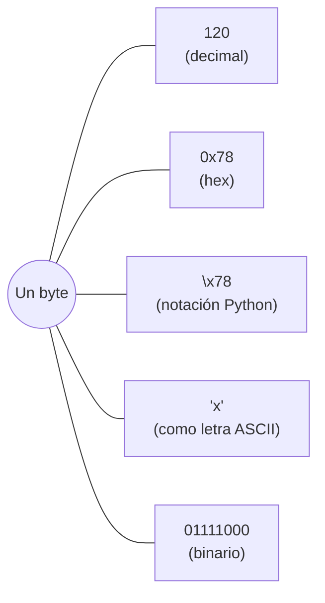
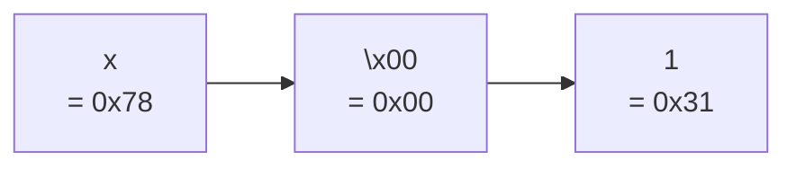
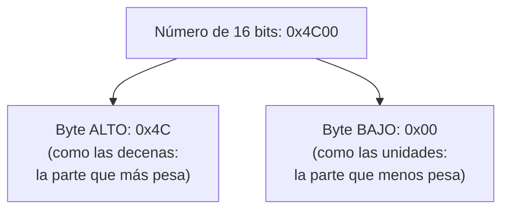
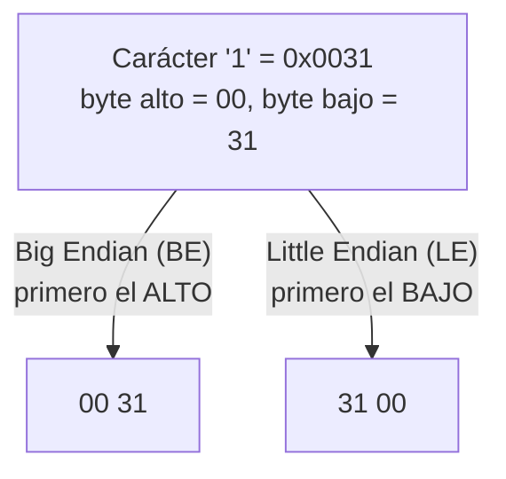
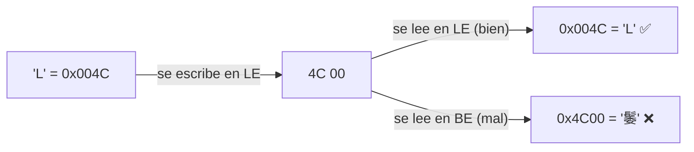
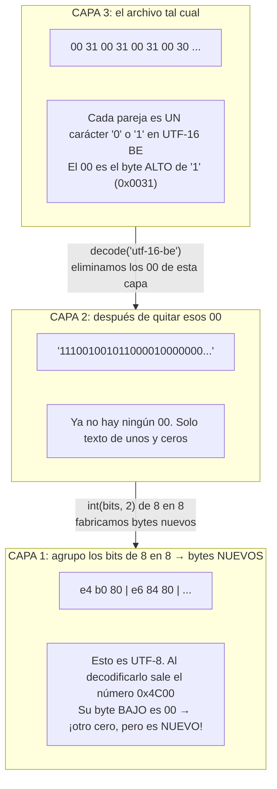
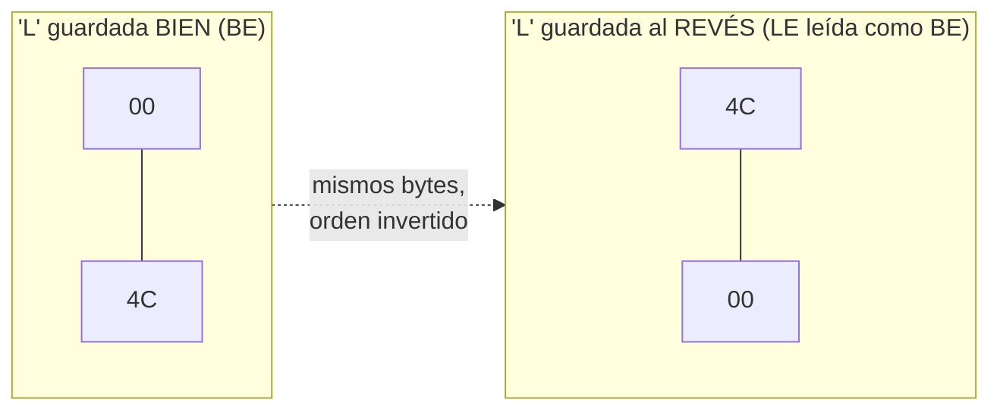
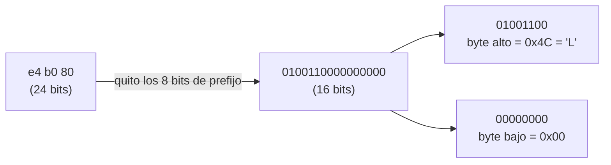

# Bytes, `\x00`, byte alto/bajo y endianness

*Material de apoyo para el writeup de **Spy Games**.*

Aquí resuelvo tres dudas que quedaron del writeup:

1. ¿Qué significa `\x00`, `\x78`, etc.?
2. ¿Qué es un "byte alto" y un "byte bajo", y **por qué vuelven a aparecer ceros si ya habíamos quitado los bytes nulos**?
3. ¿Qué es eso de Big Endian y Little Endian?

Vamos paso a paso, con ejemplos que puedes probar tú mismo en Python.

---

## 1. La notación `\x..`

### 1.1 Qué significa

Un byte es un número del 0 al 255. Hay muchas formas de escribir ese mismo número:

| Decimal | Hexadecimal | Binario    | Notación `\x` | Como carácter ASCII |
|---------|-------------|------------|---------------|---------------------|
| 0       | `0x00`      | `00000000` | `\x00`        | (nulo, invisible)   |
| 48      | `0x30`      | `00110000` | `\x30`        | `'0'`               |
| 49      | `0x31`      | `00110001` | `\x31`        | `'1'`               |
| 76      | `0x4C`      | `01001100` | `\x4c`        | `'L'`               |
| 120     | `0x78`      | `01111000` | `\x78`        | `'x'`               |

`\x78` significa **"el byte cuyo valor en hexadecimal es 78"**. La `\x` le dice a Python: "lo que viene ahora son 2 dígitos hexadecimales, no letras normales".

Así que `\x78`, `0x78`, `120` y `'x'` son **el mismo byte** escrito de cuatro maneras distintas.



### 1.2 ¿Por qué Python a veces muestra `\x..` y a veces letras?

Cuando Python imprime bytes, sigue esta regla:

- Si el byte es una letra "imprimible" (A‑Z, a‑z, 0‑9, símbolos), **la muestra como letra**.
- Si no lo es (como el `0x00`), **la muestra como `\x..`** porque no tiene dibujo.

Pruébalo tú mismo. En Kali (o cualquier Linux) abre una terminal y arranca el intérprete interactivo de Python escribiendo:

```bash
python3
```

Verás que aparece un prompt (indicador) de tres símbolos: `>>>`. **Ese `>>>` lo escribe Python, no tú**: significa "estoy esperando a que teclees algo". En los ejemplos de aquí, tú solo escribes lo que va **después** del `>>>`; la línea de debajo (sin `>>>`) es lo que Python responde. Para salir del intérprete se escribe `exit()` o se pulsa `Ctrl+D`.

```python
>>> bytes([0x78, 0x00, 0x31])
b'x\x001'
```

Esto se lee como tres bytes separados:



Por eso el error de Python en el reto se veía tan raro: `'\x001\x001\x000...'` es simplemente `\x00`, `1`, `\x00`, `1`, `\x00`, `0`... Los nulos intercalados con los caracteres.

> ⚠️ Truco de lectura: `\x` **siempre** toma exactamente 2 caracteres hexadecimales. En `\x001`, el `\x00` es un byte y el `1` que sigue es otro byte distinto.

---

## 2. Números que no caben en un byte

### 2.1 El problema

Un byte llega hasta 255. Pero Unicode tiene más de 100 000 caracteres. Por ejemplo, `'䰀'` es el número `0x4C00` = **19 456**, que no cabe en un byte.

**Solución: usar 2 bytes (16 bits).** Con 16 bits se puede contar hasta 65 535.

### 2.2 Byte alto y byte bajo: una analogía con números normales

Piensa en el número decimal **47**. Tiene dos cifras:

- `4` son las **decenas** → la parte "grande", la que más pesa.
- `7` son las **unidades** → la parte "pequeña", la que menos pesa.

Con los bytes pasa **exactamente lo mismo**, pero cada "cifra" es un byte entero:



- **Byte alto** = los primeros 8 bits = la mitad "grande".
- **Byte bajo** = los últimos 8 bits = la mitad "pequeña".

Otros ejemplos:

| Número   | Byte alto | Byte bajo | Carácter |
|----------|-----------|-----------|----------|
| `0x0031` | `00`      | `31`      | `'1'`    |
| `0x004C` | `00`      | `4C`      | `'L'`    |
| `0x4C00` | `4C`      | `00`      | `'䰀'`   |
| `0x6100` | `61`      | `00`      | `'愀'`   |

Fíjate en las dos primeras filas: **las letras ASCII normales tienen el byte alto en `00`**, porque son números pequeños (menos de 256). Es como escribir el número 7 con dos cifras: `07`. El `0` de delante no aporta nada, pero ocupa su lugar.

**Esa es la clave de los bytes nulos del reto**: cuando guardas `'1'` usando 2 bytes, te queda `00 31`. El `00` es el "cero a la izquierda".

---

## 3. Big Endian y Little Endian

### 3.1 La idea

Ya tenemos un número de 2 bytes, por ejemplo `0x0031` (el carácter `'1'`). Para guardarlo en el disco hay que escribir los dos bytes **uno detrás de otro**. La pregunta es: **¿cuál va primero?**

Solo hay dos opciones, y cada una tiene nombre:



- **Big Endian**: se empieza por el extremo (*end*) **grande** (*big*). Es como escribimos los números normalmente: `47`, primero las decenas.
- **Little Endian**: se empieza por el extremo **pequeño** (*little*). Sería como escribir el 47 al revés: `74`. Parece raro, pero los procesadores Intel/AMD (y por eso Windows) trabajan así.

### 3.2 Analogía con las fechas

Es lo mismo que pasa con las fechas:

- En España escribimos `24/09` (primero el día).
- En EE. UU. escriben `09/24` (primero el mes).

**La fecha es la misma, solo cambia el orden.** Si un español lee una fecha americana creyendo que es española, entiende mal la fecha. Con los bytes pasa igual: si lees en BE algo que se escribió en LE, obtienes **otro número** diferente.

### 3.3 Leer con el orden equivocado



Los bytes en el disco son **los mismos** (`4C 00`). Lo único que cambia es cómo los interpretas. Esa confusión es precisamente lo que produce los caracteres "chinos" del reto.

---

## 4. La duda principal: "¿no habíamos eliminado los ceros?"

Esta es la parte que más confunde, así que vamos con calma.

**Respuesta corta:** sí, eliminamos unos ceros, pero luego aparecieron **otros ceros distintos**, en **otra capa** del reto. No son los mismos.

### 4.1 La analogía de los sobres

Imagina que te llega una carta dentro de un sobre, y dentro de ese sobre hay otro sobre, y dentro otro más. **Cada sobre tiene su propio sello.** Cuando quitas el sello del primer sobre y lo abres, el segundo sobre sigue teniendo su propio sello. No es el mismo sello: es otro sobre.

Los ceros del reto son como esos sellos: **cada capa tiene los suyos**.

### 4.2 Veámoslo con datos reales



Lo importante es lo que pasa entre la capa 2 y la capa 1: **los bits de texto se convierten en bytes completamente nuevos**. Esos bytes nuevos forman caracteres nuevos (como `0x4C00`), y esos caracteres tienen su propio byte alto y su propio byte bajo. El `00` de `0x4C00` **no existía** antes: nace al decodificar la capa 1.

### 4.3 Comparando los dos ceros

|                            | Cero de la capa 3                  | Cero de la capa 1                   |
|----------------------------|------------------------------------|-------------------------------------|
| Dónde está                 | En el archivo original             | Dentro de los caracteres "chinos"   |
| Ejemplo                    | `00 31` → `'1'`                    | `0x4C00` → `'䰀'`                   |
| ¿Es el byte alto o bajo?   | **Alto** (`00` va delante)         | **Bajo** (`00` va detrás)           |
| Por qué está ahí           | `'1'` es pequeño, su alto vale 0   | Se escribió en LE y se leyó en BE   |
| Cómo se quita              | `decode('utf-16-be')`              | `ord(c) >> 8` (quedarse con el alto) |

Fíjate en la fila del medio: **en la capa 3 el cero está delante, y en la capa 1 está detrás**. Es el mismo fenómeno (una letra ASCII guardada en 2 bytes), pero en la capa 1 los bytes quedaron **dados la vuelta** por la confusión de endianness.



### 4.4 ¿Y los "16 bits" del writeup?

En UTF-8 de 3 bytes, de los 24 bits totales, 8 son prefijos fijos (`1110`, `10`, `10`). Los otros **16 bits** forman el número del carácter (el code point):



16 bits = 2 bytes, y por eso ese número tiene un byte alto y un byte bajo. En este reto, el byte alto es la letra que buscamos y el byte bajo siempre vale `00`.

`ord(c) >> 8` significa "mueve los bits 8 posiciones a la derecha". Los 8 bits del byte bajo se caen por la derecha y desaparecen, y solo queda el byte alto:

```
0x4C00 >> 8  =  0x4C  =  'L'
```

---

## 5. Pruébalo tú mismo

En la terminal de Kali (o cualquier Linux), arranca el intérprete con `python3` (aparece el prompt `>>>`) y escribe esto línea por línea. Recuerda: **solo tecleas lo que va después del `>>>`**; las líneas sin `>>>` son la respuesta de Python. Las líneas que empiezan por `>>> #` son comentarios (Python los ignora, no devuelven nada). Verlo en tu pantalla ayuda mucho más que leerlo:

```python
>>> # 1. La notación \x
>>> b'\x78'                                       # \x78 ES la letra x
b'x'

>>> # 2. Un carácter en UTF-16 BE y LE
>>> '1'.encode('utf-16-be')                       # 00 31  → el nulo va delante
b'\x001'
>>> '1'.encode('utf-16-le')                       # 31 00  → el nulo va detrás
b'1\x00'

>>> # 3. Byte alto y byte bajo
>>> hex(0x4C00 >> 8)                              # byte alto
'0x4c'
>>> hex(0x4C00 & 0xFF)                            # byte bajo
'0x0'

>>> # 4. La confusión de endianness que genera el reto
>>> 'La'.encode('utf-16-le')                      # 4C 00 61 00
b'L\x00a\x00'
>>> 'La'.encode('utf-16-le').decode('utf-16-be')  # ¡los caracteres "chinos" del reto!
'䰀愀'

>>> # 5. Y deshacerlo
>>> '䰀愀'.encode('utf-16-be').decode('utf-16-le')
'La'
```

---

## 6. Resumen en 5 frases

1. `\x78` es solo otra forma de escribir el byte `0x78` (= 120 = `'x'`). `\x00` es el byte que vale cero.
2. Si un número necesita 2 bytes, el **byte alto** es la mitad que más pesa y el **byte bajo** la que menos pesa, igual que las decenas y las unidades.
3. **Endianness** es solo el orden en que se escriben esos 2 bytes: BE = alto primero, LE = bajo primero.
4. Las letras ASCII guardadas en 2 bytes siempre llevan un `00` extra, porque su byte alto vale 0.
5. En el reto aparecen **dos grupos distintos de ceros**, uno por capa: en la capa 3 van delante (`00 31`, BE normal) y en la capa 1 van detrás (`4C 00`, bytes invertidos). Quitar los primeros no quita los segundos, porque los segundos se crean justo al decodificar la capa 1.
